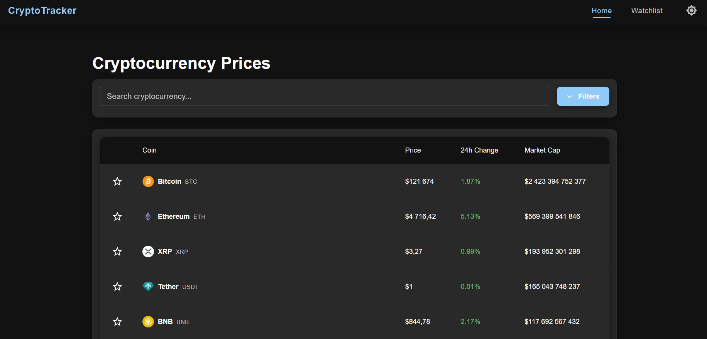

# 💹 CryptoTracker — React + TypeScript + Vite

**CryptoTracker** is a modern web application for real-time cryptocurrency tracking using the [CoinGecko API](https://www.coingecko.com/).
The project is built with **React + TypeScript + Vite**, using **Material UI**, **Redux Toolkit**, and interactive charts (**Chart.js**, **Recharts**).

---

## 🚀 Features
- 🌗 **Dark / Light theme** with user preference persistence
- 📊 **Cryptocurrency analytics** — view price, market cap, volume, and 24h change
- 📈 **Interactive price charts** using Chart.js and Recharts
- ⭐ **Watchlist** — add your favorite coins to a personal list
- 🔗 **Exchange links** — quick access to platforms where you can buy each coin
- ⚡ **Fast performance** with Vite and optimized API calls

---

## 🛠 Tech Stack

**Frontend**
- [React 19](https://react.dev/) + [TypeScript](https://www.typescriptlang.org/)
- [Vite](https://vitejs.dev/) — ultra-fast bundler
- [Material UI](https://mui.com/) — modern UI components
- [Redux Toolkit](https://redux-toolkit.js.org/) — state management
- [Axios](https://axios-http.com/) — HTTP requests
- [React Router](https://reactrouter.com/) — routing
- [Chart.js](https://www.chartjs.org/) + [react-chartjs-2](https://react-chartjs-2.js.org/)
- [Recharts](https://recharts.org/) — charts and graphs
- [Formik](https://formik.org/) + [Yup](https://github.com/jquense/yup) — form handling and validation

**API**
- [CoinGecko API](https://www.coingecko.com/en/api/documentation)

---

## 📦 Installation & Setup

> ⚠️ **IMPORTANT**: This project relies on a backend proxy (see `vite.config.ts` configuration).  
> The backend is developed in a separate GitHub repository. Without it, some features may not work.

### 1️⃣ Clone the repository
```bash
git clone https://github.com/your-username/cryptotracker.git
cd cryptotracker
```

### 2️⃣ Install dependencies
```bash
npm install
```

### 3️⃣ Start the development server
```bash
npm run dev
```
Open in your browser: **http://localhost:5173**

---

## ⚙️ Proxy Configuration (Vite)
The project is configured to forward `/api` requests to the backend:
```ts
// vite.config.ts
server: {
  proxy: {
    "/api": {
      target: "http://localhost:5000",
      changeOrigin: true,
    },
  },
}
```
> Change `target` to your server's address if your backend is deployed remotely.

---

## 📌 Known Issues
- If you switch between different coins too quickly, the CoinGecko API may temporarily block requests due to rate limits.  
  In such cases, **wait around a minute** before retrying.
- Planned improvements:
  - API request optimization
  - Local data caching
  - Extended analytics
  - Better network error handling

---

## 📷 Screenshots

---

## 📄 License
This project is licensed under the MIT License.
